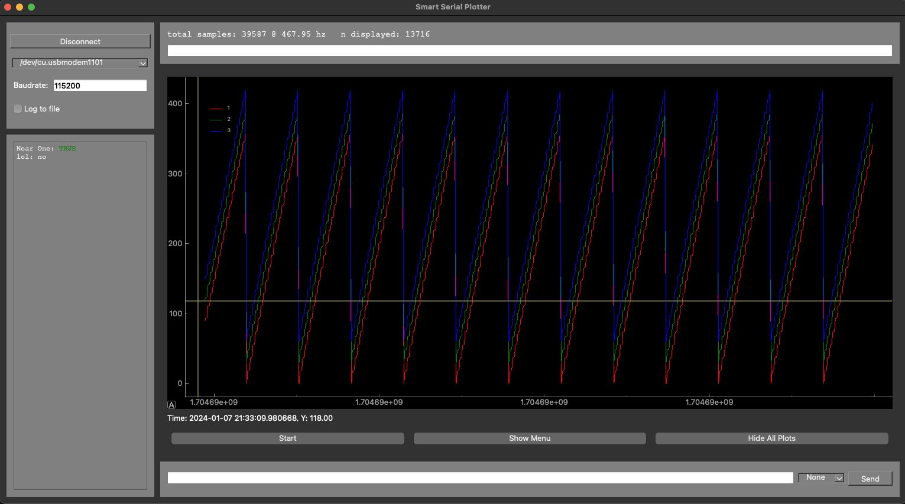

# serial-plotter

**Trends**: Display up to 9 trendlines. Toggle between live-view and a static historical view. Liveview draws new datapoints right-to-left. In static historical view, you can zoom and pan. Datapoints keep updating while in static historical view.
**Statuses**: Display live statuses on the left-pane, such as boolean variables, integers, or any other datatype that indicates the status. Examples include fault statuses, GPIO states, and anything else.

## Key Features
:white_check_mark: **Performant**: Serial reading, data processing, and visualization are all handled by independent threads. Data is shareed with threadsafe structures.

:white_check_mark: **Easy to Understand**: Codebase is contained within one directory, and the core function of the UI and data processing

:white_check_mark: **Simple Message Format**: Simple and intuitive serial message format makes this solution compatible with multiple MCUs and multiple frameworks

:white_check_mark: **Data Logging**: All messages, TX and RX, are optionally logged to a json for later analysis.

:white_check_mark: **Time Synchronization**: If available, Smart Serial Plotter can display and log events at the exact time they happened on the MCU, regardless of local latency issues.

:white_check_mark: **Easily Customizable**: Architected to make modifying to specific purposes easy

## Upcoming Features
:o: **Live Analyses**: Optional live-analysis of trendlines, overlaid on the plot. Ex. RMS noise on an ADC reading or differential voltage by subtracting two trendlines

:o: **Log Replay**: Replay live in slow-motion or view old captures from logfiles

:o: **Export to CSV**: When live analysis isn't enough, csv for export to excel or python

## Environment Setup
1. Installing packages globally (reccomended for users)
***
    pip3 install -r requirements.txt
2. Using venv (reccomended for developers)
***
    source serialplotter/bin/activate

## Running
***
    python3 main.py
